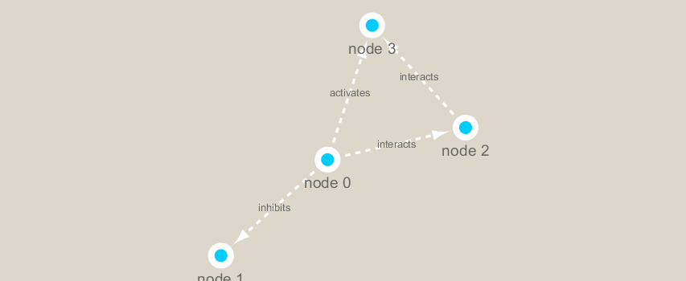

```{r setup, include=FALSE}
knitr::opts_chunk$set(echo = TRUE)
```

We will use the **RCy3** and **igraph** packages in this class.
The first is from bioconductor the secon is from CRAN

```{r}
#BiocManager::install("RCy3")
#install.packages("igraph")
library(RCy3)
library(igraph)
```

Let's check if we can talk to cytoscape.

```{r}
# Test the connection to Cytoscape.
#cytoscapePing()
```

```{r}
# Check the version
#cytoscapeVersionInfo()
```

```{r}
#g <- makeSimpleIgraph()
#createNetworkFromIgraph(g,"myGraph")
```

Change the network display style in cytoscape
```{r}
#setVisualStyle("Marquee")
```

```{r}
#fig <- exportImage(filename="demo_marquee", type="png", height=350)

#
```

```{r}
#g
```

```{r}
#plot(g)
```

Read our Metagenomics data
```{r}
## scripts for processing located in "inst/data-raw/"
prok_vir_cor <- read.delim("virus_prok_cor_abundant.tsv", stringsAsFactors = FALSE)

## Have a peak at the first 6 rows
head(prok_vir_cor)
```

```{r}
g <- graph.data.frame(prok_vir_cor, directed = FALSE)
```

```{r}
class(g)
```

```{r}
g
```

```{r}
plot(g)
```

to turn off node vertex labels
```{r}
plot(g, vertex.label=NA)
```

to make the nodes/vertices smaller
```{r}
plot(g, vertex.size=3, vertex.label=NA)
```

Send this network to cytoscape
```{r}
#createNetworkFromIgraph(g,"myIgraph")
```

clustering our network
```{r}
cb <- cluster_edge_betweenness(g)
plot(cb, y=g, vertex.label=NA,  vertex.size=3)
```

Centrality Analysis
```{r}
pr <- page_rank(g)
head(pr$vector)
```

```{r}
# Make a size vector btwn 2 and 20 for node plotting size

v.size <- BBmisc::normalize(pr$vector, range=c(2,20), method="range")
plot(g, vertex.size=v.size, vertex.label=NA)
```

```{r}
b <- betweenness(g)
v.size <- BBmisc::normalize(b, range=c(2,20), method="range")
plot(g, vertex.size=v.size, vertex.label=NA)
```

Read taxonomic classification for network annotation
```{r}
phage_id_affiliation <- read.delim("phage_ids_with_affiliation.tsv")
head(phage_id_affiliation)
```

```{r}
bac_id_affi <- read.delim("prok_tax_from_silva.tsv", stringsAsFactors = FALSE)
head(bac_id_affi)
```

Add taxonomic annotation data to network
```{r}
## Extract out our vertex names
genenet.nodes <- as.data.frame(vertex.attributes(g), stringsAsFactors=FALSE)
head(genenet.nodes)
```
How may phage (i.e. ph_) entries do we have?
```{r}
length( grep("^ph_",genenet.nodes[,1]) )
```
Therefore we have 81 non phage nodes.

Now lets merge() these with the annotation data
```{r}
# We dont need all annotation data so lets make a reduced table 'z' for merging
z <- bac_id_affi[,c("Accession_ID", "Kingdom", "Phylum", "Class")]
n <- merge(genenet.nodes, z, by.x="name", by.y="Accession_ID", all.x=TRUE)
head(n)
```

```{r}
# Check on the column names before deciding what to merge
colnames(n)
```

```{r}
colnames(phage_id_affiliation)
```

```{r}
# Again we only need a subset of `phage_id_affiliation` for our purposes
y <- phage_id_affiliation[, c("first_sheet.Phage_id_network", "phage_affiliation","Tax_order", "Tax_subfamily")]

# Add the little phage annotation that we have
x <- merge(x=n, y=y, by.x="name", by.y="first_sheet.Phage_id_network", all.x=TRUE)

## Remove duplicates from multiple matches
x <- x[!duplicated( (x$name) ),]
head(x)
```
Save our merged annotation results back to genenet.nodes
```{r}
genenet.nodes <- x
```

Send network to Cytoscape using RCy3

Now we will send this network from R to Cytoscape.

To begin we will delete any windows and networks that were already open in Cytoscape. This will clean the slate and help ensure we don't use up all of our memory.
```{r}
# Open a new connection and delete any existing windows/networks in Cy
#deleteAllNetworks()
```

```{r}
# Set the main nodes colname to the required "id" 
colnames(genenet.nodes)[1] <- "id"
```

Add to the network the data related to the connections between the organisms, the edge data, and then send the nodes and edges data.frames to Cytoscape using the function createNetworkFromDataFrames().


