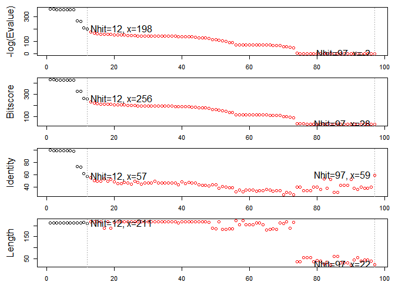

Class11
================
Michelle Janossy
5/7/2019

## The PDB database

The [PDB](http://www.rcsb.org/) is the main repository for biomolecular
structure data.

Here we examine the contents of the PDB:

> Q1: Download a CSV file from the PDB site (accessible from “Analyze”
> -\> “PDB Statistics” \> “by Experimental Method and Molecular Type”.
> Move this CSV file into your RStudio project and determine the
> percentage of structures solved by X-Ray and Electron Microscopy. From
> the website what proportion of structures are protein? Aim to have a
> rendered GitHub document with working code that yields your answers.

``` r
db <- read.csv("Data Export Summary.csv", row.names = 1)
head(db)
```

    ##                     Proteins Nucleic.Acids Protein.NA.Complex Other  Total
    ## X-Ray                 126880          2012               6547     8 135447
    ## NMR                    11062          1279                259     8  12608
    ## Electron Microscopy     2277            31                800     0   3108
    ## Other                    256             4                  6    13    279
    ## Multi Method             129             5                  2     1    137

How many are X-Ray, etc…

``` r
(db$Total/sum(db$Total))*100
```

    ## [1] 89.35736481  8.31777489  2.05041595  0.18406244  0.09038191

What percent are Protein…

``` r
sum(db$Proteins)/sum(db$Total)*100
```

    ## [1] 92.75955

We could also try the datapasta package and copy from website and
“Addins” \> “Paste as data.frame”…

``` r
library(datapasta)

tmp <- data.frame(stringsAsFactors=FALSE,
   Experimental.Method = c("X-Ray", "Other", "NMR", "Multi Method",
                           "Electron Microscopy", "Total"),
              Proteins = c(126880, 256, 11062, 129, 2277, 140604),
         Nucleic.Acids = c(2012, 4, 1279, 5, 31, 3331),
    ProteinComplex = c(6547, 6, 259, 2, 800, 7614),
                 Other = c(8, 13, 8, 1, 0, 30),
                 Total = c(135447, 279, 12608, 137, 3108, 151579)
)
```

> Q2: Type HIV in the PDB website search box on the home page and
> determine how many HIV-1 protease structures are in the current PDB?

There are 1157 as of 2019-05-07 see:
<http://www.rcsb.org/pdb/results/results.do?tabtoshow=Current&qrid=40D8F533>

``` r
library(bio3d)

pdb <- read.pdb("1hsg.pdb")
pdb
```

    ## 
    ##  Call:  read.pdb(file = "1hsg.pdb")
    ## 
    ##    Total Models#: 1
    ##      Total Atoms#: 1686,  XYZs#: 5058  Chains#: 2  (values: A B)
    ## 
    ##      Protein Atoms#: 1514  (residues/Calpha atoms#: 198)
    ##      Nucleic acid Atoms#: 0  (residues/phosphate atoms#: 0)
    ## 
    ##      Non-protein/nucleic Atoms#: 172  (residues: 128)
    ##      Non-protein/nucleic resid values: [ HOH (127), MK1 (1) ]
    ## 
    ##    Protein sequence:
    ##       PQITLWQRPLVTIKIGGQLKEALLDTGADDTVLEEMSLPGRWKPKMIGGIGGFIKVRQYD
    ##       QILIEICGHKAIGTVLVGPTPVNIIGRNLLTQIGCTLNFPQITLWQRPLVTIKIGGQLKE
    ##       ALLDTGADDTVLEEMSLPGRWKPKMIGGIGGFIKVRQYDQILIEICGHKAIGTVLVGPTP
    ##       VNIIGRNLLTQIGCTLNF
    ## 
    ## + attr: atom, xyz, seqres, helix, sheet,
    ##         calpha, remark, call

Atom selection is done via the function **atom.select()**

> Q6. How many amino acid residues are there in this pdb object and what
> are the two nonprotein residues?

``` r
prot.pdb <- atom.select(pdb, "protein", value = TRUE)
write.pdb(prot.pdb, file = "1hsg_protein.pdb")
lig.pdb <- atom.select(pdb, "ligand", value = TRUE)
write.pdb(lig.pdb, file = "1hsg_protein.pdb")
```

Section 5

``` r
aa <- get.seq("1ake_A")
```

    ## Warning in get.seq("1ake_A"): Removing existing file: seqs.fasta

``` r
# Blast or hmmer search
b <- blast.pdb(aa)
```

    ##  Searching ... please wait (updates every 5 seconds) RID = FDGV8KE101R 
    ##  .
    ##  Reporting 97 hits

``` r
hits <- plot(b)
```

    ##   * Possible cutoff values:    197 -3 
    ##             Yielding Nhits:    12 97 
    ## 
    ##   * Chosen cutoff value of:    197 
    ##             Yielding Nhits:    12

<!-- -->

``` r
head(hits$pdb.id)
```

    ## [1] "1AKE_A" "4X8M_A" "4X8H_A" "3HPR_A" "1E4V_A" "5EJE_A"

``` r
# Fetch PDBs
#files <- get.pdb(hits$pdb.id, path="pdbs", split=TRUE, gzip=TRUE)
# Align structures
#pdbs <- pdbaln(files)
# Vector containing PDB codes
#ids <- basename.pdb(pdbs$id)
# Draw schematic alignment
#plot(pdbs, labels=ids)
```
