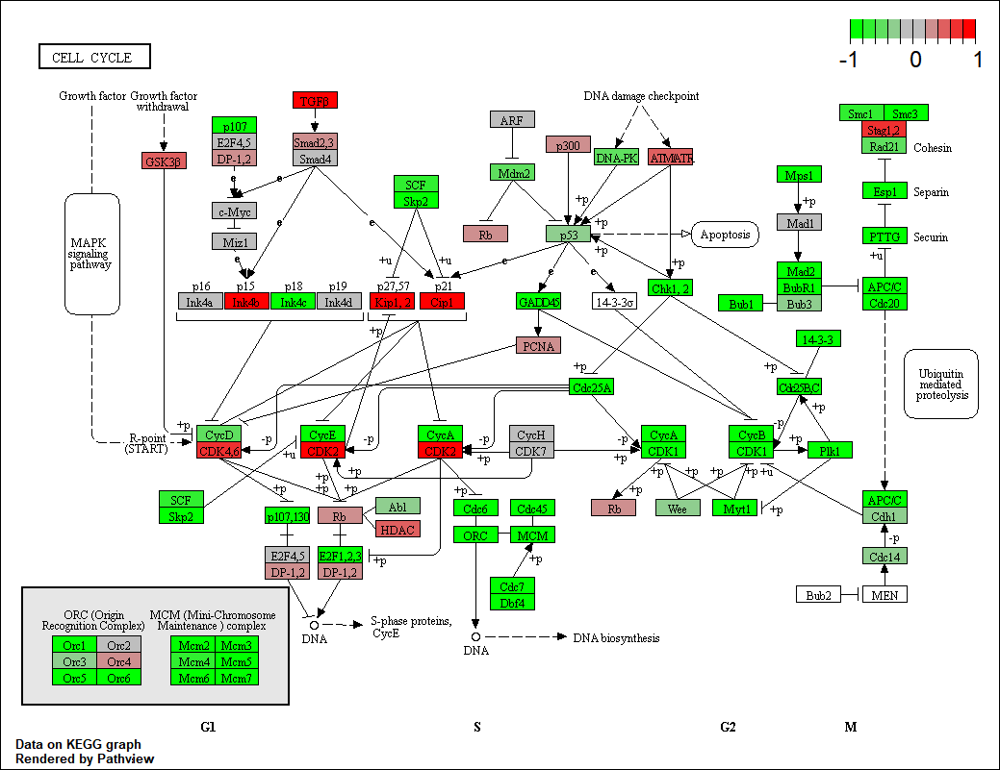

Class15
================
Michelle Janossy
5/21/2019

Pathway Analysis from RNA-Seq Results

## RNA-Seq Analysis

The data for the hands-on session comes from GEO entry: GSE37704, which
is associated with the following publication:

Trapnell C, Hendrickson DG, Sauvageau M, Goff L et al. “Differential
analysis of gene regulation at transcript resolution with RNA-seq”. Nat
Biotechnol 2013 Jan;31(1):46-53. PMID: 23222703.

``` r
#library(DESeq2)
```

``` r
metaFile <- "GSE37704_metadata.csv"
countFile <- "GSE37704_featurecounts.csv"

# Import metadata and take a peak
colData = read.csv(metaFile, row.names=1)
head(colData)
```

    ##               condition
    ## SRR493366 control_sirna
    ## SRR493367 control_sirna
    ## SRR493368 control_sirna
    ## SRR493369      hoxa1_kd
    ## SRR493370      hoxa1_kd
    ## SRR493371      hoxa1_kd

``` r
# Import countdata
countData = read.csv(countFile, row.names=1)
head(countData)
```

    ##                 length SRR493366 SRR493367 SRR493368 SRR493369 SRR493370
    ## ENSG00000186092    918         0         0         0         0         0
    ## ENSG00000279928    718         0         0         0         0         0
    ## ENSG00000279457   1982        23        28        29        29        28
    ## ENSG00000278566    939         0         0         0         0         0
    ## ENSG00000273547    939         0         0         0         0         0
    ## ENSG00000187634   3214       124       123       205       207       212
    ##                 SRR493371
    ## ENSG00000186092         0
    ## ENSG00000279928         0
    ## ENSG00000279457        46
    ## ENSG00000278566         0
    ## ENSG00000273547         0
    ## ENSG00000187634       258

Hmm… remember that we need the countData and colData files to match up
so we will need to remove that odd first column in countData namely
contData$length.

``` r
#Q. Complete the code below to remove the troublesome first column from  countData

# Note we need to remove the odd first $length col
countData <- as.matrix(countData[,-1])
head(countData)
```

    ##                 SRR493366 SRR493367 SRR493368 SRR493369 SRR493370
    ## ENSG00000186092         0         0         0         0         0
    ## ENSG00000279928         0         0         0         0         0
    ## ENSG00000279457        23        28        29        29        28
    ## ENSG00000278566         0         0         0         0         0
    ## ENSG00000273547         0         0         0         0         0
    ## ENSG00000187634       124       123       205       207       212
    ##                 SRR493371
    ## ENSG00000186092         0
    ## ENSG00000279928         0
    ## ENSG00000279457        46
    ## ENSG00000278566         0
    ## ENSG00000273547         0
    ## ENSG00000187634       258

This looks better but there are lots of zero entries in there so let’s
get rid of them as we have no data for
these.

``` r
#Q. Complete the code below to filter countData to exclude genes (i.e. rows) where we have 0 read count across all samples (i.e. columns).

#Tip: What will rowSums() of countData return and how could you use it in this context?

# Filter count data where you have 0 read count across all samples.
nonzero.rows <- rowSums(countData) !=0
countData <- countData[nonzero.rows,]
head(countData)
```

    ##                 SRR493366 SRR493367 SRR493368 SRR493369 SRR493370
    ## ENSG00000279457        23        28        29        29        28
    ## ENSG00000187634       124       123       205       207       212
    ## ENSG00000188976      1637      1831      2383      1226      1326
    ## ENSG00000187961       120       153       180       236       255
    ## ENSG00000187583        24        48        65        44        48
    ## ENSG00000187642         4         9        16        14        16
    ##                 SRR493371
    ## ENSG00000279457        46
    ## ENSG00000187634       258
    ## ENSG00000188976      1504
    ## ENSG00000187961       357
    ## ENSG00000187583        64
    ## ENSG00000187642        16

``` r
#other option: x <- (rowSums(countData) > 0)

nrow(countData)
```

    ## [1] 15975

Nice now lets setup the DESeqDataSet object required for the DESeq()
function and then run the DESeq pipeline. This is again similar to our
last days hands-on
session.

``` r
#dds = DESeqDataSetFromMatrix(countData=countData,colData=colData,design=~condition)
#dds = DESeq(dds)
```

``` r
#dds
```

results

``` r
#res <- results(dds)
#summary(res)
```

Now we will make a volcano plot, a commonly produced visualization from
this type of data that we introduced last day. Basically it’s a plot of
log2 fold change vs -log adjusted p-value.

``` r
#plot( res$log2FoldChange, -log(res$padj) )
#abline(v=c(-2,2), col = "green", lty = 2, lwd = 2)
#abline(h=log(0.01), col = "green", lty = 2, lwd = 2)
```

``` r
#Q. Improve this plot by completing the below code, which adds color and axis labels

# Make a color vector for all genes
#mycols <- rep("gray", nrow(res) )

# Color red the genes with absolute fold change above 2
#mycols[ abs(res$log2FoldChange) > 2 ] <- "red"

# Color blue those with adjusted p-value less than 0.01
#  and absolute fold change more than 2
#inds <- (res$padj < 0.01) & (abs(res$log2FoldChange) > 2 )
#mycols[ inds ] <- "blue"

#plot( res$log2FoldChange, -log(res$padj), col=mycols, xlab="Log2(FoldChange)", ylab="-Log(P-value)" )
```

Add annotation (i.e. different gene names and ids) Q. Use the mapIDs()
function multiple times to add SYMBOL, ENTREZID and GENENAME annotation
to our results by completing the code below.

``` r
library("AnnotationDbi")
```

    ## Loading required package: stats4

    ## Loading required package: BiocGenerics

    ## Loading required package: parallel

    ## 
    ## Attaching package: 'BiocGenerics'

    ## The following objects are masked from 'package:parallel':
    ## 
    ##     clusterApply, clusterApplyLB, clusterCall, clusterEvalQ,
    ##     clusterExport, clusterMap, parApply, parCapply, parLapply,
    ##     parLapplyLB, parRapply, parSapply, parSapplyLB

    ## The following objects are masked from 'package:stats':
    ## 
    ##     IQR, mad, sd, var, xtabs

    ## The following objects are masked from 'package:base':
    ## 
    ##     anyDuplicated, append, as.data.frame, basename, cbind,
    ##     colMeans, colnames, colSums, dirname, do.call, duplicated,
    ##     eval, evalq, Filter, Find, get, grep, grepl, intersect,
    ##     is.unsorted, lapply, lengths, Map, mapply, match, mget, order,
    ##     paste, pmax, pmax.int, pmin, pmin.int, Position, rank, rbind,
    ##     Reduce, rowMeans, rownames, rowSums, sapply, setdiff, sort,
    ##     table, tapply, union, unique, unsplit, which, which.max,
    ##     which.min

    ## Loading required package: Biobase

    ## Welcome to Bioconductor
    ## 
    ##     Vignettes contain introductory material; view with
    ##     'browseVignettes()'. To cite Bioconductor, see
    ##     'citation("Biobase")', and for packages 'citation("pkgname")'.

    ## Loading required package: IRanges

    ## Loading required package: S4Vectors

    ## 
    ## Attaching package: 'S4Vectors'

    ## The following object is masked from 'package:base':
    ## 
    ##     expand.grid

    ## 
    ## Attaching package: 'IRanges'

    ## The following object is masked from 'package:grDevices':
    ## 
    ##     windows

``` r
library("org.Hs.eg.db")
```

    ## 

``` r
columns(org.Hs.eg.db)
```

    ##  [1] "ACCNUM"       "ALIAS"        "ENSEMBL"      "ENSEMBLPROT" 
    ##  [5] "ENSEMBLTRANS" "ENTREZID"     "ENZYME"       "EVIDENCE"    
    ##  [9] "EVIDENCEALL"  "GENENAME"     "GO"           "GOALL"       
    ## [13] "IPI"          "MAP"          "OMIM"         "ONTOLOGY"    
    ## [17] "ONTOLOGYALL"  "PATH"         "PFAM"         "PMID"        
    ## [21] "PROSITE"      "REFSEQ"       "SYMBOL"       "UCSCKG"      
    ## [25] "UNIGENE"      "UNIPROT"

``` r
#res$symbol = mapIds(org.Hs.eg.db, keys=row.names(res),  keytype="ENSEMBL", column="SYMBOL",multiVals="first")

#res$entrez = mapIds(org.Hs.eg.db,keys=row.names(res), keytype="ENSEMBL",column="ENTREZID",multiVals="first")

#res$name =   mapIds(org.Hs.eg.db,keys=row.names(res),keytype="ENSEMBL",column="GENENAME",multiVals="first")

#head(res, 10)
```

``` r
#head(as.data.frame(res))
```

Q. Finally for this section let’s reorder these results by adjusted
p-value and save them to a CSV file in your current project directory.

``` r
#res = res[order(res$pvalue),]
#write.csv(res, file="deseq_results.csv")
```

Time estimate 11am

## Section 2.

``` r
# Run in your R console (i.e. not your Rmarkdown doc!)
#BiocManager::install( c("pathview", "gage", "gageData") )

# For old vesrsions of R only (R < 3.5.0)!
#source("http://bioconductor.org/biocLite.R")
#biocLite( c("pathview", "gage", "gageData") )
```

``` r
#library(pathview)
#library(gage)
#library(gageData)
```

``` r
#data(kegg.sets.hs)
#data(sigmet.idx.hs)

#Focus on signaling and metabolic pathways only
#kegg.sets.hs = kegg.sets.hs[sigmet.idx.hs]
```

``` r
#head(kegg.sets.hs, 3)
```

Create a vector of FoldChange values that has ENTREZ identifiers as the
names of the vector. This is the format that the **gage()** function
wants.

``` r
#foldchanges = res$log2FoldChange
#names(foldchanges) = res$entrez
#head(foldchanges)
```

Run the **gage()** function with this input

``` r
# Get the results
#keggres = gage(foldchanges, gsets=kegg.sets.hs)
```

Now lets look at the object returned from gage().

``` r
#attributes(keggres)
```

``` r
#head(keggres$less)
```

Now, let’s try out the pathview() function from the pathview package to
make a pathway plot with our RNA-Seq expression results shown in color.

``` r
#pathview(gene.data=foldchanges, pathway.id="hsa04110")
```



``` r
# A different PDF based output of the same data
#pathview(gene.data=foldchanges, pathway.id="hsa04110", kegg.native=FALSE)
```

Now, let’s process our results a bit more to automagicaly pull out the
top 5 upregulated pathways, then further process that just to get the
pathway IDs needed by the pathview() function. We’ll use these KEGG
pathway IDs for pathview plotting below.

``` r
## Focus on top 5 upregulated pathways here for demo purposes only
#keggrespathways <- rownames(keggres$greater)[1:5]

# Extract the 8 character long IDs part of each string
#keggresids = substr(keggrespathways, start=1, stop=8)
#keggresids
```

Finally, lets pass these IDs in keggresids to the pathview() function to
draw plots for all the top 5 pathways.

``` r
#pathview(gene.data=foldchanges, pathway.id=keggresids, species="hsa")
```

\#\#Section 3. Gene Ontology (GO)

We can also do a similar procedure with gene ontology. Similar to above,
go.sets.hs has all GO terms. go.subs.hs is a named list containing
indexes for the BP, CC, and MF ontologies. Let’s focus on BP (a.k.a
Biological Process) here.

``` r
#data(go.sets.hs)
#data(go.subs.hs)

# Focus on Biological Process subset of GO
#gobpsets = go.sets.hs[go.subs.hs$BP]

#gobpres = gage(foldchanges, gsets=gobpsets, same.dir=TRUE)

#lapply(gobpres, head)
```

\#\#Section 4.Reactome Analysis Let’s now conduct over-representation
enrichment analysis and pathway-topology analysis with Reactome using
the previous list of significant genes generated from our differential
expression results above.

First, Using R, output the list of significant genes at the 0.05 level
as a plain text file:

``` r
#sig_genes <- res[res$padj <= 0.05 & !is.na(res$padj), "symbol"]
#print(paste("Total number of significant genes:", length(sig_genes)))
```

``` r
#write.table(sig_genes, file="significant_genes.txt", row.names=FALSE, col.names=FALSE, quote=FALSE)
```
